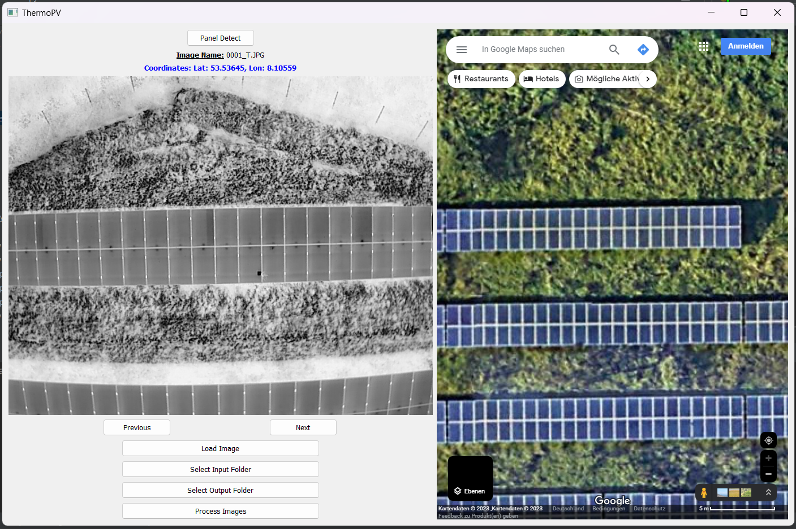
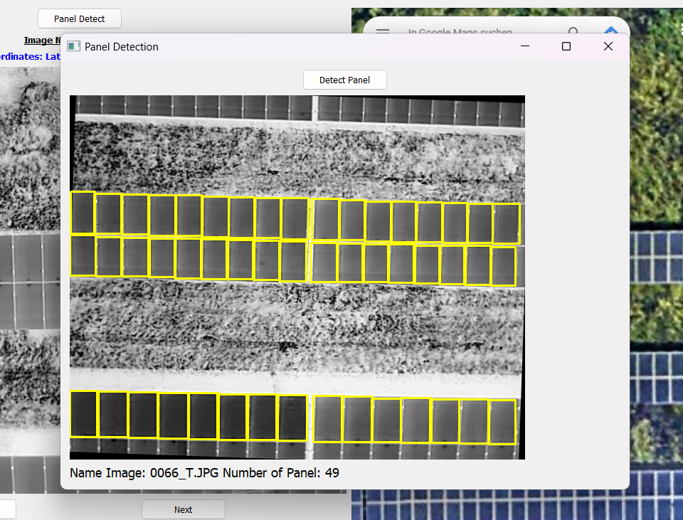

# Advanced-Image-Processor
Process and analyze images using OpenCV and PyQt5
It can correct image distortion, rotate images, and extract GPS data from images' EXIF metadata.
## Features

- Corrects distortion in images.
- Rotates images to desired angles.
- Provides a GUI to navigate through processed images.
- Displays image names and extracted GPS coordinates.
  
## Dependencies

- Python 3.x
- OpenCV (for image processing)
- PyQt5 (for GUI components)
- Pillow (for EXIF metadata extraction)

## Usage
Clone the repository:
   

## App

# Detecting Solar Panels

